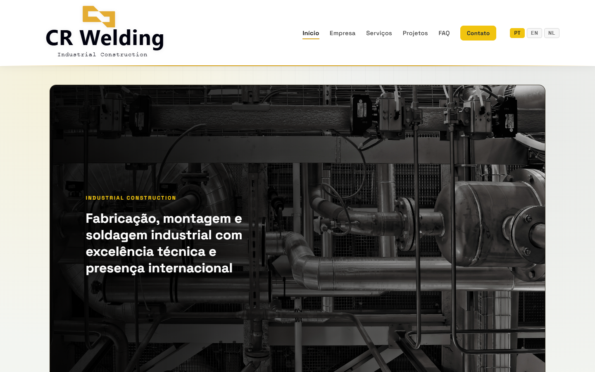
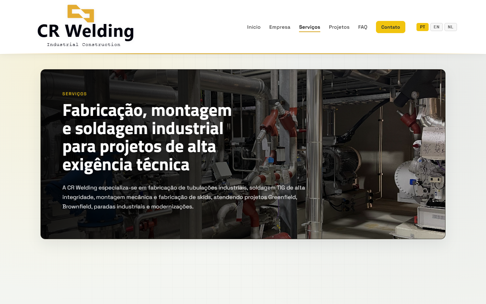
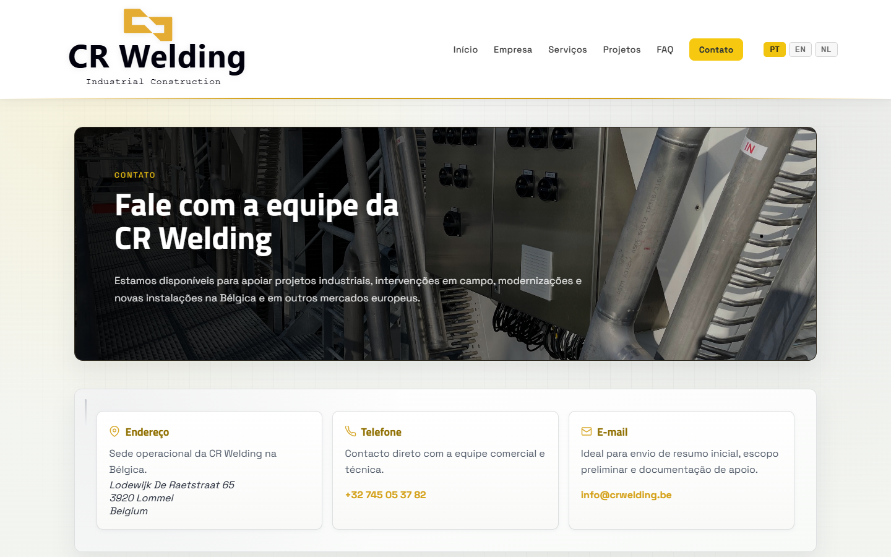
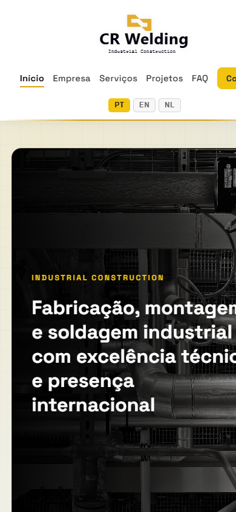

# CR Welding — Site Institucional

> Site institucional desenvolvido para a **CR Welding**, empresa especializada em fabricação de tubulações industriais, soldagem TIG de alta integridade, fabricação e montagem de skids e estruturas metálicas, com atuação internacional na Europa.

[](https://dieguin77.github.io/Celio-Welding/)
[](https://developer.mozilla.org/en-US/docs/Web/HTML)
[](https://developer.mozilla.org/en-US/docs/Web/CSS)
[](https://developer.mozilla.org/en-US/docs/Web/JavaScript)

---

## Demonstração

### Desktop







### Mobile



---

## Tecnologias Utilizadas

| Tecnologia | Uso |
|---|---|
| **HTML5** | Estrutura semântica das páginas |
| **CSS3** | Estilização, animações e layout responsivo |
| **JavaScript (Vanilla)** | Internacionalização (PT/EN/NL), interatividade e DOM |
| **SVG** | Logo vetorial e favicon gerados a partir do arquivo `.ai` original |
| **GitHub Pages** | Hospedagem e publicação do site |

---

## Funcionalidades

- **Multinível de navegação** — 12 páginas HTML interligadas
- **Internacionalização** — suporte a 3 idiomas: Português, Inglês e Holandês
- **Layout 100% responsivo** — otimizado para Desktop, Tablet e Mobile
- **Logo vetorial** — SVG gerado matematicamente a partir do arquivo Adobe Illustrator original
- **Favicon completo** — `favicon.svg`, `favicon.ico` (16/32/48px) e `apple-touch-icon.png`
- **SEO técnico** — meta tags, Open Graph, Twitter Card, `sitemap.xml` e `robots.txt`
- **Formulário de contato** integrado com `mailto:`
- **FAQ interativo** com elemento `<details>`/`<summary>` nativo
- **Animações CSS** de entrada (`reveal` via IntersectionObserver)
- **Web Manifest** para instalação como PWA

---

## Páginas do Site

| Página | Arquivo |
|---|---|
| Início | `index.html` |
| Empresa | `sobre.html` |
| Serviços | `servicos.html` |
| Projetos | `projetos.html` |
| FAQ | `faq.html` |
| Contato | `contato.html` |
| Carreiras | `carreiras.html` |
| Qualidade | `qualidade.html` |
| Certificações e Compliance | `certificacoes-compliance.html` |
| Setores Atendidos | `setores-atendidos.html` |
| Sustentabilidade | `sustentabilidade.html` |
| Números e Escala | `numeros-escala.html` |

---

## Conceitos Aplicados

- **Responsividade** — Grid CSS, Flexbox e breakpoints para 3 tamanhos de tela
- **SEO básico** — meta `description`, Open Graph, Twitter Card, `sitemap.xml`, `robots.txt`
- **Manipulação do DOM** — sistema de i18n em Vanilla JS, troca dinâmica de idioma
- **UI/UX** — hierarquia visual, tipografia industrial, identidade visual premium
- **Estruturação semântica** — uso de `<header>`, `<nav>`, `<main>`, `<section>`, `<article>`, `<aside>`, `<footer>`, `<details>`, `<address>`
- **Performance** — imagens com `loading="lazy"` e `decoding="async"`, CSS crítico inline
- **Acessibilidade** — atributos `aria-label`, `aria-hidden`, `role`, `aria-pressed`
- **SVG vetorial** — logo e favicon sem perda de qualidade em qualquer resolução
- **Identidade visual** — cores, tipografia e símbolo extraídos do arquivo de marca original (`.ai` / PDF-1.6)

---

## Estrutura do Projeto

```
celio-welding/
├── index.html                    # Página principal
├── sobre.html                    # Empresa
├── servicos.html                 # Serviços
├── projetos.html                 # Projetos
├── faq.html                      # Perguntas frequentes
├── contato.html                  # Contato
├── carreiras.html                # Carreiras
├── qualidade.html                # Qualidade
├── certificacoes-compliance.html # Certificações
├── setores-atendidos.html        # Setores
├── sustentabilidade.html         # Sustentabilidade
├── numeros-escala.html           # Números e escala
├── styles.css                    # Estilos globais
├── script.js                     # JS: i18n, animações, interatividade
├── favicon.svg                   # Favicon vetorial
├── favicon.ico                   # Favicon multi-tamanho (16/32/48px)
├── apple-touch-icon.png          # Ícone iOS (180×180)
├── site.webmanifest              # Web App Manifest
├── sitemap.xml                   # Mapa do site para SEO
├── robots.txt                    # Instruções para crawlers
├── assets/
│   └── brand/
│       ├── logo-oficial.svg      # Logo header (fundo claro)
│       ├── logo-oficial-light.svg# Logo footer (fundo escuro)
│       ├── foto-cr-*.jpeg        # Fotografias institucionais
│       └── ...
└── imagens/                      # Screenshots para documentação
```

---

## Projeto Online

🔗 **[https://dieguin77.github.io/Celio-Welding/](https://dieguin77.github.io/Celio-Welding/)**

---

## Como Executar Localmente

```bash
# Clone o repositório
git clone https://github.com/Dieguin77/Celio-Welding.git

# Acesse a pasta
cd Celio-Welding

# Abra com Live Server (VS Code) ou qualquer servidor estático
# Ou simplesmente abra o index.html no navegador
```

> Não há dependências de build. O projeto é 100% estático (HTML + CSS + JS puro).

---

## Desenvolvedor

**Diego Batista Gomes Moraes**

[](https://github.com/Dieguin77)
[](https://diegodev.dev.br)

---

*Projeto desenvolvido com foco em qualidade técnica, identidade visual premium e apresentação institucional profissional.*
